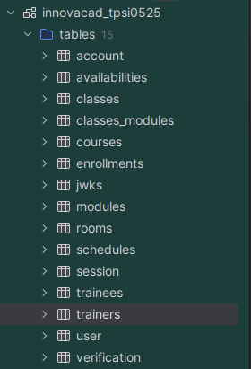

# InnovAcad - Academic Management System

<div align="center">

**A comprehensive management platform for ATEC's secretariat, integrating Web, Mobile, and AI-powered scheduling solutions**


</div>

---

## 📋 Table of Contents

- [Overview](#-overview)
- [Features](#-features)
- [Technology Stack](#-technology-stack)
- [Project Structure](#-project-structure)
- [System Architecture](#-system-architecture)
- [Database Schema](#-database-schema)
- [Installation](#-installation)
- [API Documentation](#-api-documentation)
- [Deployment](#-deployment)
- [Contributing](#-contributing)
- [License](#-license)

---

## 🎯 Overview

**InnovAcad** is a full-stack academic management system designed for ATEC (Academia de Formação) to streamline secretariat operations, course management, and student tracking. The platform consists of multiple integrated applications:

- **Web Application**: Comprehensive dashboard with CRUD operations and visual schedule management
- **Mobile Application**: Quick lookup tool for on-the-go access to schedules and information
- **Intelligent Chatbot**: AI-powered assistant for student and staff queries
- **Automated Schedule Generator**: Smart scheduling system that considers room availability, trainer skills, and class requirements

This system was developed as the final project for the TPSI0525 course at ATEC.

---

## ✨ Features

### 🌐 Web Application (Back-Office)

- **Dashboard Overview**: Real-time statistics and insights
- **User Management**: Complete CRUD operations for trainees, trainers, and administrative staff
- **Course Management**:
  - Create and manage courses with modules
  - Define module sequences and dependencies
  - Assign trainers based on competency levels
- **Class Management**:
  - Track class status (starting, ongoing, finished)
  - Manage enrollments and student lists
  - Monitor class progress and completion
- **Schedule Management**:
  - Visual calendar interface powered by FullCalendar
  - Drag-and-drop schedule creation
  - Conflict detection for trainers and rooms
  - Support for online and in-person sessions
- **Grade Management**:
  - Multiple grade types (attendance, behavior, work, test, final)
  - Automatic attendance grade calculation
  - Draft and finalized grade statuses
  - Final grade computation for enrollments
- **Room Management**:
  - Track room capacity and equipment
  - Real-time availability checking
- **Trainer Availability Management**:
  - Trainers can set their availability by time slots
  - Integration with schedule creation
- **Document Management**:
  - Upload and categorize documents
  - Associate documents with users
  - Support for multiple file types
- **Attendance Tracking**:
  - Daily summaries for each schedule
  - Mark student absences
  - Automatic grade updates based on attendance
- **Authentication & Security**:
  - Two-factor authentication (2FA)
  - Email verification
  - Session management
  - Role-based access control
  - Password reset functionality
- **Internationalization**: Multi-language support (i18n)

### 📱 Mobile Application

- **Quick Access**: Fast lookup of schedules and class information
- **Student Portal**: View grades, attendance, and course progress
- **Trainer Portal**: Check daily schedules and class assignments
- **Offline Support**: Access cached data without internet connection
- **Push Notifications**: Real-time updates for schedule changes

### 🤖 Intelligent Features

- **Chatbot Assistant**: Natural language queries for information retrieval
- **Automatic Schedule Generation**:
  - AI-powered scheduling algorithm
  - Considers trainer skills and availability
  - Optimizes room utilization
  - Respects module dependencies and sequences
  - Handles online/in-person session allocation

### 📊 Statistics & Reporting

- **Real-time Analytics**: Dashboard with key metrics
- **Grade Reports**: Comprehensive student performance analysis
- **Attendance Reports**: Track student participation
- **Trainer Utilization**: Monitor trainer workload and availability

---

## 🛠 Technology Stack

### Backend

#### Main API (`innovacad_api`)

- **Language**: Dart 3.10+
- **Framework**: Vaden 1.0.2 (Dart web framework)
- **Architecture**: Clean Architecture with layers:
  - `domain`: Business logic and entities
  - `data`: Repositories, DAOs, and DTOs
  - `api`: HTTP endpoints and routing
  - `core`: Shared utilities and configurations
- **Key Libraries**:
  - `mysql_client_plus` (0.1.2): MySQL database connectivity
  - `mysql_utils` (2.1.12): Database utilities
  - `vaden_security` (1.0.0): Security and authentication
  - `dart_jsonwebtoken` (3.3.1): JWT token handling
  - `result_dart` (2.1.1): Functional error handling
  - `json_annotation` (4.9.0): JSON serialization
  - `uuid` (4.5.2): UUID generation
  - `mailer` (6.6.0): Email functionality
  - `dotenv` (4.2.0): Environment configuration
  - `shelf_multipart` (2.0.1): File upload support
  - `pdf` (3.11.3): PDF generation
  - `redis` (4.0.0): Caching and session storage
  - `dio` (5.9.0): HTTP client
  - `web_socket_channel` (3.0.2): WebSocket support

#### Authentication API (`innovacad_auth_api`)

- **Runtime**: Bun (Fast JavaScript runtime)
- **Framework**: ElysiaJS (Latest)
- **Authentication**: Better-Auth 1.4.7
- **Key Libraries**:
  - `mysql2` (3.16.0): MySQL database driver
  - `nodemailer` (7.0.12): Email services
  - `@elysiajs/cors` (1.4.0): CORS middleware
- **Features**:
  - OAuth integration
  - Session management
  - Email verification
  - Password reset
  - 2FA support

### Frontend

#### Web Application (`innovacad_web`)

- **Framework**: SolidJS 1.9.10 (Reactive JavaScript framework)
- **Language**: TypeScript 5.9.3
- **Build Tool**: Vite (Rolldown optimization)
- **Routing**: @solidjs/router 0.15.4
- **Styling**:
  - TailwindCSS 4.1.18: Utility-first CSS framework
  - DaisyUI 5.5.14: Component library for Tailwind
- **Key Libraries**:
  - `fullcalendar` (6.1.20): Schedule visualization
  - `i18next` (25.8.6): Internationalization
  - `@mbarzda/solid-i18next` (1.4.1): i18n for SolidJS
  - `js-cookie` (3.0.5): Cookie management
  - `lucide-solid` (0.562.0): Icon library
  - `solid-toast` (0.5.0): Toast notifications
  - `nodemailer` (7.0.12): Email integration
- **Code Quality**: Biome 2.3.11 (Linting and formatting)

#### Mobile Application (`innovacad_mobile`)

- **Framework**: Flutter (Cross-platform development)
- **Platform Support**: Android (with potential iOS expansion)
- **Architecture**: Following Flutter best practices
- **Build System**: Gradle (Kotlin DSL)

### Database

- **DBMS**: MySQL
- **Schema Name**: `innovacad_tpsi0525`
- **Key Tables** (24 total):
  - `user`, `session`, `account`, `verification`: Authentication
  - `trainers`, `trainees`: User roles
  - `courses`, `classes`, `modules`: Course structure
  - `courses_modules`, `classes_modules`: Relationships
  - `schedules`, `schedule_slots`, `ref_slots`: Scheduling
  - `availabilities`: Trainer availability
  - `rooms`: Facility management
  - `enrollments`: Student enrollments
  - `grades`: Student assessments
  - `attendances`, `summaries`: Attendance tracking
  - `documents`, `document_types`: Document management
  - `trainer_skills`: Trainer competencies
  - `trainers_classes_coordinator`: Class coordinators
- **Advanced Features**:
  - Stored procedures for complex operations
  - Triggers for automatic grade calculations
  - Comprehensive indexing for performance
  - Foreign key constraints for data integrity
  - Cascading deletes for referential integrity

### DevOps & Deployment

- **Version Control**: Git
- **Build Script**: Bash (automated deployment)
- **Services**: systemd (Linux service management)
  - `innovacad`: Main API service
  - `innovacad-auth`: Authentication API service
- **Compilation**:
  - Dart API compiled to native executable
  - Auth API bundled with Bun
- **Development Tools**:
  - Biome: Code linting and formatting
  - Build runners for code generation

---

## 📁 Project Structure

```
Final_Project_Innovacad_TPSI0525/
│
├── innovacad_api/                   # Main Dart API
│   ├── bin/
│   │   └── server.dart             # API entry point
│   ├── lib/
│   │   └── src/
│   │       ├── api/                # HTTP endpoints
│   │       ├── core/               # Shared utilities
│   │       ├── data/               # Data layer
│   │       │   ├── attendance/     # Attendance repositories & DAOs
│   │       │   ├── availability/   # Trainer availability
│   │       │   ├── class/          # Class management
│   │       │   ├── class_module/   # Class-module relationships
│   │       │   ├── course/         # Course management
│   │       │   ├── course_module/  # Course-module relationships
│   │       │   ├── document/       # Document management
│   │       │   ├── enrollment/     # Student enrollments
│   │       │   ├── grade/          # Grade management
│   │       │   ├── module/         # Module definitions
│   │       │   ├── room/           # Room management
│   │       │   ├── schedule/       # Schedule operations
│   │       │   ├── statistics/     # Analytics
│   │       │   ├── summary/        # Class summaries
│   │       │   ├── trainee/        # Student data
│   │       │   ├── trainer/        # Trainer data
│   │       │   └── user/           # User management
│   │       └── domain/             # Business logic
│   └── pubspec.yaml                # Dart dependencies
│
├── innovacad_auth_api/              # Authentication API (Bun + Elysia)
│   ├── src/
│   │   ├── modules/
│   │   │   └── auth/               # Better-Auth configuration
│   │   └── index.ts                # API entry point
│   └── package.json                # Node dependencies
│
├── innovacad_web/                   # SolidJS Web Application
│   ├── src/
│   │   ├── api/                    # API client functions
│   │   ├── assets/                 # Static assets
│   │   ├── components/             # Reusable UI components
│   │   ├── hooks/                  # Custom SolidJS hooks
│   │   ├── locale/                 # Internationalization files
│   │   ├── pages/                  # Application pages
│   │   │   ├── Dashboard/          # Main dashboard
│   │   │   │   ├── Grade/          # Grade management
│   │   │   │   ├── User/           # User management
│   │   │   │   │   └── Trainer/    # Trainer-specific views
│   │   │   │   └── ...             # Other dashboard pages
│   │   │   ├── Classes/            # Class CRUD
│   │   │   ├── Courses/            # Course CRUD
│   │   │   ├── Rooms/              # Room CRUD
│   │   │   ├── Schedules/          # Schedule management
│   │   │   ├── Trainees/           # Trainee CRUD
│   │   │   ├── Trainers/           # Trainer CRUD
│   │   │   ├── SignIn/             # Authentication
│   │   │   ├── ForgotPassword/     # Password recovery
│   │   │   ├── ResetPassword/      # Password reset
│   │   │   ├── Verify2FA/          # 2FA verification
│   │   │   ├── VerifyEmail/        # Email verification
│   │   │   ├── Landing/            # Landing page
│   │   │   ├── home.tsx            # Home page
│   │   │   └── about.tsx           # About page
│   │   ├── providers/              # Context providers
│   │   ├── types/                  # TypeScript definitions
│   │   ├── utils/                  # Helper functions
│   │   ├── index.css               # Global styles
│   │   └── index.tsx               # App entry point
│   ├── tailwind.config.js          # Tailwind configuration
│   └── package.json                # Dependencies
│
├── innovacad_mobile/                # Flutter Mobile Application
│   ├── android/                    # Android configuration
│   ├── ios/                        # iOS configuration (optional)
│   └── app/                        # Flutter app source
│
├── innovacad_database/              # Database Scripts
│   ├── create_innovacad_database.sql        # Schema creation
│   ├── default_data_insert.sql              # Initial data
│   ├── drop_innovacad_database.sql          # Cleanup script
│   ├── stored_procedures_innovacad.sql      # Stored procedures
│   ├── drop_stored_procedures_innovacad.sql # Procedure cleanup
│   ├── filtering_queries.sql                # Query examples
│   ├── testing_innovacad.sql                # Test queries
│   └── innovacad_database_schema.png        # Visual schema
│
├── innovacad_docs/                  # Documentation
│
├── docs/                            # Additional documentation
│
├── build.sh                         # Automated deployment script
├── .gitignore                       # Git ignore rules
├── LICENSE                          # Apache 2.0 License
└── README.md                        # This file
```

---

## 🏗 System Architecture

### Architecture Pattern: Clean Architecture

The project follows **Clean Architecture** principles, particularly in the Dart API:

```
┌─────────────────────────────────────────────────────┐
│                  Presentation Layer                  │
│            (Web App, Mobile App, API Routes)         │
└────────────────────┬────────────────────────────────┘
                     │
┌────────────────────▼────────────────────────────────┐
│                   Domain Layer                       │
│          (Business Logic, Entities, Use Cases)       │
└────────────────────┬────────────────────────────────┘
                     │
┌────────────────────▼────────────────────────────────┐
│                    Data Layer                        │
│        (Repositories, DAOs, DTOs, Data Sources)      │
└────────────────────┬────────────────────────────────┘
                     │
┌────────────────────▼────────────────────────────────┐
│              Infrastructure Layer                    │
│          (MySQL Database, File System, Redis)        │
└─────────────────────────────────────────────────────┘
```

---

## 🗄 Database Schema

The database consists of 24 interconnected tables designed to handle all aspects of academic management:

### Core Entities

- **Users & Authentication**: `user`, `session`, `account`, `verification`
- **Roles**: `trainers`, `trainees`
- **Academic Structure**: `courses`, `classes`, `modules`
- **Relationships**: `courses_modules`, `classes_modules`

### Scheduling System

- **Schedules**: `schedules`, `schedule_slots`, `ref_slots`
- **Availability**: `availabilities`
- **Resources**: `rooms`

### Academic Tracking

- **Enrollment**: `enrollments`
- **Assessment**: `grades` (5 types: attendance, behavior, work, test, final)
- **Attendance**: `attendances`, `summaries`

### Additional Features

- **Documents**: `documents`, `document_types`
- **Skills**: `trainer_skills` (competency levels)
- **Coordinators**: `trainers_classes_coordinator`

### Advanced Database Features

#### Stored Procedures

- `sp_refresh_single_trainee_attendance`: Automatically calculates attendance grades
- `sp_update_enrollment_final_grade`: Updates final grades for enrollments

#### Triggers

- `tr_after_attendance_update`: Updates grades when attendance is recorded
- `tr_after_attendance_change`: Updates grades when attendance is modified
- `tr_after_grade_insert`: Updates final enrollment grades
- `tr_after_grade_update`: Handles grade status changes

#### Indexing Strategy

- 25+ indexes for optimized query performance
- Composite indexes for common query patterns
- Lock order indexes to prevent deadlocks



---

## 🚀 Installation

### Prerequisites

- **Dart SDK**: 3.10 or higher
- **Bun**: Latest version
- **MySQL**: 8.0 or higher
- **Redis**: 6.0 or higher (for caching)
- **Flutter**: Latest stable (for mobile app)
- **Node.js/Bun**: For web application development

### Database Setup

1. **Create the database**:

   ```bash
   mysql -u root -p < innovacad_database/create_innovacad_database.sql
   ```

2. **Insert default data**:

   ```bash
   mysql -u root -p < innovacad_database/default_data_insert.sql
   ```

3. **Create stored procedures**:
   ```bash
   mysql -u root -p < innovacad_database/stored_procedures_innovacad.sql
   ```

### Main API Setup (`innovacad_api`)

1. **Install dependencies**:

   ```bash
   cd innovacad_api
   dart pub get
   ```

2. **Configure environment**:
   Create a `.env` file with:

   ```env
   DB_HOST=localhost
   DB_PORT=3306
   DB_NAME=innovacad_tpsi0525
   DB_USER=your_user
   DB_PASSWORD=your_password
   REDIS_HOST=localhost
   REDIS_PORT=6379
   JWT_SECRET=your_jwt_secret
   SMTP_HOST=smtp.example.com
   SMTP_PORT=587
   SMTP_USER=your_email
   SMTP_PASSWORD=your_password
   ```

3. **Run in development**:

   ```bash
   dart run bin/server.dart
   ```

4. **Build for production**:
   ```bash
   dart compile exe bin/server.dart -o server
   ```

### Authentication API Setup (`innovacad_auth_api`)

1. **Install dependencies**:

   ```bash
   cd innovacad_auth_api
   bun install
   ```

2. **Configure environment**:
   Create a `.env` file with Better-Auth configuration

3. **Run migrations**:

   ```bash
   bun run migrate
   ```

4. **Run in development**:

   ```bash
   bun run dev
   ```

5. **Build for production**:
   ```bash
   bun run build
   ```

### Web Application Setup (`innovacad_web`)

1. **Install dependencies**:

   ```bash
   cd innovacad_web
   npm install
   # or
   bun install
   ```

2. **Configure API endpoints**:
   Update the API URLs in `src/api/` to point to your backend

3. **Run in development**:

   ```bash
   npm run dev
   # or
   bun run dev
   ```

4. **Build for production**:
   ```bash
   npm run build
   # or
   bun run build
   ```

### Mobile Application Setup (`innovacad_mobile`)

1. **Install Flutter dependencies**:

   ```bash
   cd innovacad_mobile/app
   flutter pub get
   ```

2. **Configure API endpoints**:
   Update API URLs in the configuration files

3. **Run on Android**:

   ```bash
   flutter run
   ```

4. **Build APK**:
   ```bash
   flutter build apk --release
   ```

---

## 📚 API Documentation

### Main API Endpoints

#### Authentication

- `POST /api/auth/login` - User login
- `POST /api/auth/logout` - User logout
- `POST /api/auth/verify-2fa` - Verify 2FA code

#### Users

- `GET /api/users` - List all users
- `GET /api/users/:id` - Get user by ID
- `POST /api/users` - Create new user
- `PUT /api/users/:id` - Update user
- `DELETE /api/users/:id` - Delete user

#### Trainees

- `GET /api/trainees` - List all trainees
- `GET /api/trainees/:id` - Get trainee details
- `POST /api/trainees` - Create trainee
- `PUT /api/trainees/:id` - Update trainee
- `DELETE /api/trainees/:id` - Delete trainee

#### Trainers

- `GET /api/trainers` - List all trainers
- `GET /api/trainers/:id` - Get trainer details
- `GET /api/trainers/:id/skills` - Get trainer skills
- `POST /api/trainers` - Create trainer
- `PUT /api/trainers/:id` - Update trainer
- `DELETE /api/trainers/:id` - Delete trainer

#### Courses

- `GET /api/courses` - List all courses
- `GET /api/courses/:id` - Get course details
- `GET /api/courses/:id/modules` - Get course modules
- `POST /api/courses` - Create course
- `PUT /api/courses/:id` - Update course
- `DELETE /api/courses/:id` - Delete course

#### Classes

- `GET /api/classes` - List all classes
- `GET /api/classes/:id` - Get class details
- `GET /api/classes/:id/enrollments` - Get class enrollments
- `POST /api/classes` - Create class
- `PUT /api/classes/:id` - Update class
- `DELETE /api/classes/:id` - Delete class

#### Schedules

- `GET /api/schedules` - List all schedules
- `GET /api/schedules/:id` - Get schedule details
- `GET /api/schedules/class/:classId` - Get schedules for a class
- `POST /api/schedules` - Create schedule
- `POST /api/schedules/generate` - Auto-generate schedule
- `PUT /api/schedules/:id` - Update schedule
- `DELETE /api/schedules/:id` - Delete schedule

#### Grades

- `GET /api/grades/trainee/:traineeId` - Get trainee grades
- `GET /api/grades/class/:classId` - Get class grades
- `POST /api/grades` - Create grade
- `PUT /api/grades/:id` - Update grade
- `PUT /api/grades/:id/finalize` - Finalize grade
- `DELETE /api/grades/:id` - Delete grade

#### Attendance

- `GET /api/attendance/schedule/:scheduleId` - Get attendance for schedule
- `POST /api/attendance` - Record attendance
- `PUT /api/attendance/:id` - Update attendance

#### Rooms

- `GET /api/rooms` - List all rooms
- `GET /api/rooms/:id` - Get room details
- `GET /api/rooms/available` - Check room availability
- `POST /api/rooms` - Create room
- `PUT /api/rooms/:id` - Update room
- `DELETE /api/rooms/:id` - Delete room

#### Documents

- `GET /api/documents/user/:userId` - Get user documents
- `POST /api/documents` - Upload document
- `DELETE /api/documents/:id` - Delete document

#### Statistics

- `GET /api/statistics/dashboard` - Get dashboard statistics
- `GET /api/statistics/trainee/:id` - Get trainee statistics
- `GET /api/statistics/trainer/:id` - Get trainer statistics

### Response Format

All API responses follow this structure:

```json
{
  "success": true,
  "data": { ... },
  "message": "Operation successful"
}
```

Error responses:

```json
{
  "success": false,
  "error": "Error message",
  "code": "ERROR_CODE"
}
```

---

## 🚢 Deployment

### Automated Deployment Script

The project includes a `build.sh` script for automated deployment:

```bash
chmod +x build.sh
./build.sh
```

This script:

1. Stops the running services
2. Compiles the Dart API to a native executable
3. Builds the Auth API with Bun
4. Restarts both systemd services
5. Displays service status

### Manual Deployment

#### Setting up systemd Services

1. **Create service file for Main API** (`/etc/systemd/system/innovacad.service`):

   ```ini
   [Unit]
   Description=InnovAcad Main API
   After=network.target mysql.service

   [Service]
   Type=simple
   User=www-data
   WorkingDirectory=/path/to/innovacad_api
   ExecStart=/path/to/innovacad_api/server
   Restart=on-failure

   [Install]
   WantedBy=multi-user.target
   ```

2. **Create service file for Auth API** (`/etc/systemd/system/innovacad-auth.service`):

   ```ini
   [Unit]
   Description=InnovAcad Auth API
   After=network.target mysql.service

   [Service]
   Type=simple
   User=www-data
   WorkingDirectory=/path/to/innovacad_auth_api
   ExecStart=/path/to/innovacad_auth_api/build/api
   Restart=on-failure

   [Install]
   WantedBy=multi-user.target
   ```

3. **Enable and start services**:
   ```bash
   sudo systemctl enable innovacad
   sudo systemctl enable innovacad-auth
   sudo systemctl start innovacad
   sudo systemctl start innovacad-auth
   ```

### Project Team

- **Course**: TPSI0525
- **Institution**: ATEC - Academia de Formação
- **Project Type**: Final Project

---

## 📄 License

This project is licensed under the Apache License 2.0 - see the [LICENSE](LICENSE) file for details.

---

<div align="center">

**Built with ❤️ for academic excellence**

_InnovAcad - Innovating Academic Management_

</div>
